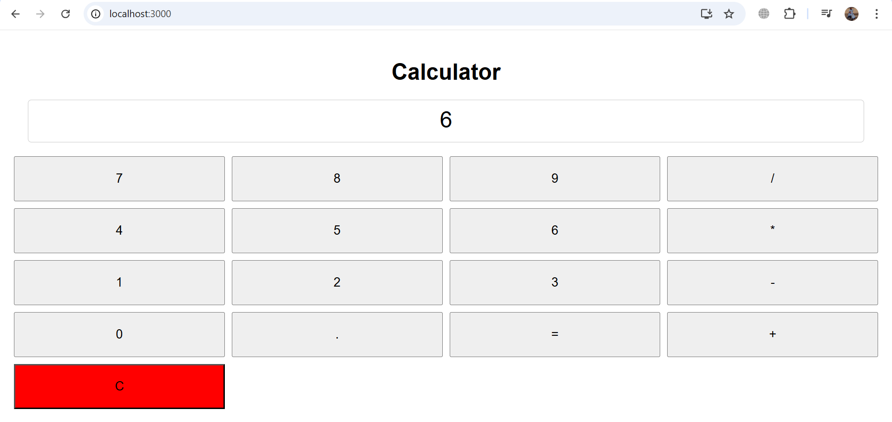

## Features

- **Basic Arithmetic Operations**: Perform addition, subtraction, multiplication, and division.
- **User-friendly Interface**: Simple and intuitive design.
- **Responsive Design**: Works on different screen sizes.
- **Error Handling**: Displays error messages for invalid inputs.
- **Lightweight and Fast**: Optimized for performance.

## Technologies Used

- Frontend: HTML, CSS, JavaScript

## Installation

1. Clone the repository:
   ```bash
   git clone https://github.com/GIZE21/calculator-app.git
   ```
2. Navigate to the project directory:
   ```bash
   cd calculator-app
   ```
3. Open `index.html` in your browser or start a local server.

## Usage

1. Open the calculator in a browser.
2. Use the buttons to input numbers and operations.
3. Click `=` to compute the result.
4. Click `C` to clear the display.
